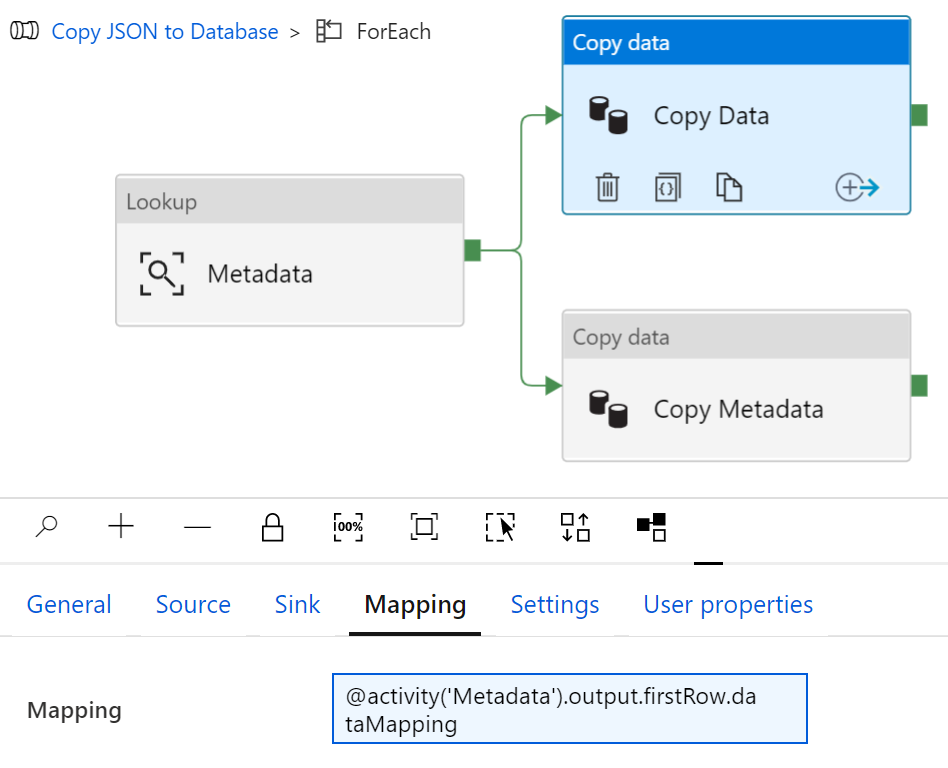

# xls2adf

Excel file loader with ready-to-use JSON object for Azure Data Factory.

## Install

```bash
npm install @tsart/xls2adf
```

## Usage

```typescript
import * as parser from '@tsart/xls2adf';

let blob: any = fs.readFileSync('test.xls');
let files: parser.OutputFormat[] = parser.parseXLSX(config, blob);
```

See more samples in `__test__` folder.

## Config schema

This sample config defines `A1`, `A2` cells and `B4:C7` range to extract as JSON document.

```yml
domain: excel
fileName: test.xls
fileOptions:
  cellDates: true

# Destination
resultObjects:
  - name: testDS
    columns:
      - ReportDate
      - ReportTitle
    dataset: Table

# Excel cells definitions
cells:
  - name: ReportDate
    sheetName: Sheet1
    cell: A1
  - name: ReportTitle
    sheetName: Sheet1
    cell: A2

# Excel datasets definitions
datasets:
  - name: Table
    sheetName: Sheet1
    range: B4:C7
```

## Output

```json
OutputFormat {
  domain: string;
  objectName: string;
  description?: string;
  source: {
    type: string;
    fileName: string;
    description?: string;
  };
  timestamp: Date;
  columns: Column[];
  dataMapping?: Mapping;
  metaMapping?: Mapping;
  defaultSettings: DefaultSettings;
  ddlPreCopyScript: string;
  data: any[];
}
```

### Mapping

`dataMapping` and `metaMapping` objects are ready to use as dynamic mapping attributes in ADF Copy Activity


### PreCopy Script

`ddlPreCopyScript` holds generated T-SQL statement that creates a new table with defined Excel dataset `<Columns>` and deletes existing rows if table needs a reload.

```sql
IF SCHEMA_ID('{{schemaName}}') IS NULL EXEC ('CREATE SCHEMA [{{schemaName}}]');
IF OBJECT_ID('[{{schemaName}}].[{{tableName}}]') IS NULL
CREATE TABLE [{{schemaName}}].[{{tableName}}] (
  <Columns>,
  [dwSource] varchar(1000),
  [dwSnapshotOn] DateTime
);
DELETE FROM [{{schemaName}}].[{{tableName}}] WHERE dwSnapshotOn = '{{timestamp}}';
```

`{{schemaName}}`, `{{tableName}}`, and `{{timestamp}}` placeholders should be replaced with the ADF pipeline logic.

## Credits and Contributions

Thank you [daikiueda](https://github.com/daikiueda/xls2adf) for sample Excel files and a few good insights.
Any contribution and suggestions is welcome.
